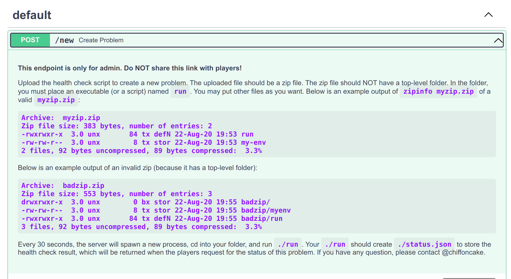

# Health Check 1 / Health Check 2
> Balsn CTF 2022 [web]
>
> Author: @chiffoncake

To be honest, these challenges are more like "misc" than "web". Sorry for those who expect more pure "web" challenges.

These two challenges are inspired by the new [Challenges Health](https://balsnctf.com/health) feature of our CTF, whose backend is mainly developed by me. This feature is achieved by collecting a "health check script" from all the authors of each challenge, and we run their scripts periodically and upload the results to let players browse them.

## Deployment

This challenge is not run in docker. If you want to run it locally, you can follow the steps below:

1. Create a virtual machine (VMWare, Virtual, etc.) and install Ubuntu 22.04 server. Default user name should be `uploaded`.
2. `sudo apt update && sudo apt install -y docker.io python3-pip authbind` and `pip install "fastapi[all]" gunicorn`
3. Create a user `healthcheck`. Give him `sudo` permission and let him [`sudo` without password](https://www.cyberciti.biz/faq/linux-unix-running-sudo-command-without-a-password/). Add him to group `docker`.
4. Remove user `uploaded` from group `sudo`. (disable him from using `sudo`)
5. Put the source code into `~healthcheck/app`.
6. Run the following commands by user `healthcheck`:
   ```
   cd ~/app
   sudo chown -R healthcheck:uploaded .
   sudo chown healthcheck:uploaded ~
   chmod 700 ~
   chmod 644 *
   chmod 700 launch.sh
   ```
7. Use `healthcheck` (instead of `root`) to run `./launch.sh`

## Challenge Description

```
Want to know whether the challenge is down or it's just your network down? Want to know who to send a message when you want to contact an admin of some challenges? Take a look at our "fastest" Health Check API in the world!

http://fastest-healthcheck.balsnctf.com

Warning: Do not violate our CTF rules.

Author: chiffoncake
```

## Writeup: Part 1

First, you have to go to `/docs` page of this website. There are many ways to get to this point:

1. Read the problem description and notice the keywords "fastest" and "API". You may guess that it is a [FastAPI](https://balsnctf.com/health) server, so it has `/docs` page.
2. Take a look at server's HTTP response header and you will see `server: uvicorn`. [Uvicorn](https://www.uvicorn.org/) along with API server is commonly related to FastAPI framework. So, it has `/docs` page.
3. Use a dictionary to brute-force the path and find `/docs` page. *You should be careful* since some tools with default parameters (such as `dirbuster`) may be regarded as malware behavior by your ISP, which might get yourself banned from accessing your network.

Then, you can find the following content:



Seems like you have found a hidden endpoint which by design should only be accessed by admin. You can use the following snippet to create a testing zip:

```bash
cat > run << EOF
#!/bin/bash
id > status.json 2>&1
pwd >> status.json 2>&1
ls -al . >> status.json 2>&1
ls -al .. >> status.json 2>&1
ls -al ../.. >> status.json 2>&1
EOF

zip test.zip run
```

Then, use the web UI of `/docs` page to upload the zip file, and get the returned `dir_name`, say, `test-209d510faf7d0663`. You can query the content of `status.json` at `/test-209d510faf7d0663` after 30 seconds. The result should be something like:

```
uid=65534(nobody) gid=65534(nogroup) groups=65534(nogroup)
/home/healthcheck/app/data/test-209d510faf7d0663
total 16
drwxrwxrwx 2 healthcheck healthcheck 4096 Sep  7 07:51 .
drwx--x--x 3 healthcheck uploaded    4096 Sep  7 07:50 ..
-rwxrwxrwx 1 healthcheck healthcheck  150 Sep  7 07:50 run
-rw-r--r-- 1 nobody      nogroup      108 Sep  7 07:51 status.json
ls: cannot open directory '..': Permission denied
total 40
drwxrwxr-x 4 healthcheck uploaded 4096 Sep  7 07:45 .
drwx------ 8 healthcheck uploaded 4096 Sep  7 07:44 ..
-rw-r--r-- 1 healthcheck uploaded 2892 Sep  7 07:42 apiserver.py
-rw-r--r-- 1 healthcheck uploaded 2013 Sep  7 07:42 background.py
drwx--x--x 3 healthcheck uploaded 4096 Sep  7 07:50 data
-rw-r--r-- 1 healthcheck uploaded   62 Sep  7 07:42 Dockerfile
-r--r----- 1 healthcheck uploaded   50 Sep  7 07:42 flag1.py
-r--r----- 1 healthcheck uploaded   35 Sep  7 07:42 flag2
-rwx------ 1 healthcheck uploaded  497 Sep  7 07:43 launch.sh
drwxr-xr-x 2 healthcheck uploaded 4096 Sep  7 07:45 __pycache__
```

It is obvious that you can leak the source code by `cat ../../apiserver.py ../../background.py ../../Dockerfile > status.json`. Then, you will find that in `background.py`, flag1 is imported, which means in `__pycache__` should be a compiled bytecode of `flag1.py`. Luckily, `__pycache__/flag1.cpython-310.pyc` is readable by everyone, so you can just print it and get the flag.

flag: `BALSN{y37_4n0th3r_pYC4ch3_cHa1leN93???}`

> *Note that by default, the `*.pyc` file will have the same permission of its python source file. To make this challenge solvable, I run a `chmod 644 flag1.py flag2` in `launch.sh` and `os.chmod('flag1.py', 0o440)` in `background.py` sequentially. Therefore, in the end `flag1.py` seems unreadable by `nobody` but pyc looks readable.*

## Writeup: Part 2

You can see that flag2 is opened and read into memory in `apiserver.py`. However, that is not exploitable. Wandering in the source code, you can find something suspicious:

```python
if 'docker-entry' in os.listdir(path_name):
    # experimental
    container_name = path_name.name + random.randbytes(8).hex()
    await asyncio.create_subprocess_shell(f'sleep 60; docker kill {container_name} &')
    await asyncio.create_subprocess_shell(f'sudo chmod -R a+rwx {path_name}; cd {path_name}; chmod a+x ./docker-entry; docker run --rm --cpus=".25" -m="256m" -v=$(realpath .):/data -u=user -w=/data --name {container_name} sandbox /data/docker-entry')
else:
    await asyncio.create_subprocess_shell(f'sudo chmod -R a+rwx {path_name}; cd {path_name}; sudo -u nobody timeout --signal=KILL 60 ./run')
```

If you provide `docker-entry` instead of `run` in the uploaded zip file, the server will run your `docker-entry` inside a container called `sandbox`. Here is the interesting part. The `user` user in docker container is created in `Dockerfile`, which has a default uid 1000 (you can `cat /etc/passwd` to find it out). Meanwhile, the user `uploaded` has a default uid 1000, too. That is to say, you can create any file in `/data` inside the docker container, which by the setting of the volume would be the folder of your uploaded zip file, and the permission of your files created inside container would be uid 1000, which would be regarded as user `uploaded` on the host machine.

To sum up, you can create files with the permission of user `uploaded` inside the folder of your uploaded zip file. Then how to exploit it?

In linux there are `setuid()` and `setgid()`, which can let a user run a program using the permission of the program owner. Therefore, you can use `docker-entry` to create a `run` and let `run` do `setgid()`. Since `run` has the permission of group `uploaded`, it can simply print flag2. A final reminder is that your `docker-entry` should remove itself so that in the next round `run` can be executed.

The script can be found in folder [solution](./solution/).

flag: `BALSN{d0cK3r_baD_8ad_ro07_B4d_b@d}`

## Postscript

Some players asked why they got an error when running `ls ..`. It's because the permission of `~/app/data` is `drwx--x--x`. If you search Google for "linux directory permission", you will find that you need an `r` permission to list the directory and an `x` permission to `cd` into it. Therefore, your `ls ..` will lead to an error since you don't have `r` permission, whereas `ls ../..` (you can use `cd ..; cd ..; ls .` if it helps to comprehend) is allowed since you have `x` permission.

After all, if you have the permission to `ls ~/app/data`, you will be able to peek at other players' payload. That's not fun at all, isn't it :-)

## Special Thanks

This is my first time creating a CTF challenge for such a big contest. Thanks @Ginoah for checking my idea and implementation. Thanks @Jwang for making this challenge more safe to implement. Thanks @bookgin for instant help when the service was down during the contest.

Finally, thank anyone who tried my challenge and not gave up on me when the service was down. Hope you enjoy it!
